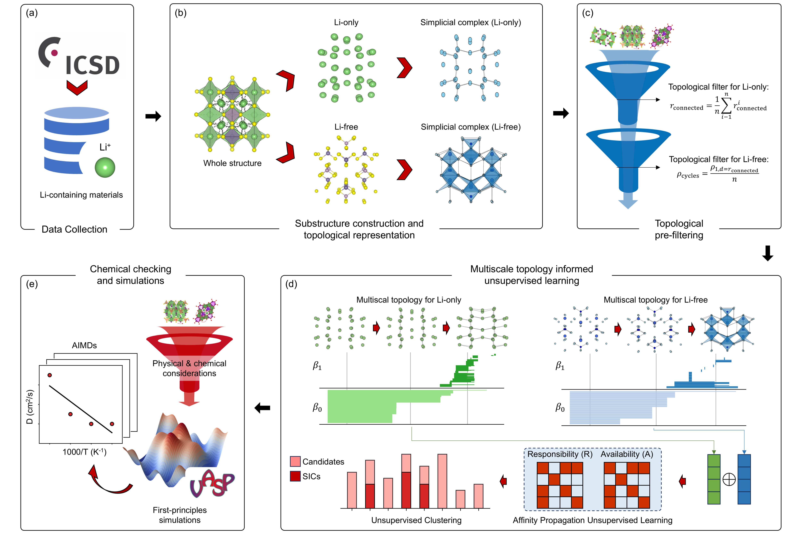

# MTUL-LSIC

<div align='center'>
 
<!-- [](https://www.google.com/) -->
[](https://opensource.org/licenses/MIT)

</div>

**Title** - MTUL-LSIC: Multiscale topology-informed unsupervised learning for Superionic Ionic Conductors

**Authors** - Dong Chen, Bingxu Wang, Shunning Li, Wentao Zhang, Kai Yang, Yongli Song, Guo-Wei Wei and Feng Pan

---

## Table of Contents

- [MTUL-LSIC](#MTUL-LSIC)
  - [Table of Contents](#table-of-contents)
  - [Introduction](#introduction)
  - [Model Architecture](#model-architecture)
  - [Getting Started](#getting-started)
    - [Prerequisites](#prerequisites)
    - [Installation](#installation)
  - [Datasets](#datasets)
  - [Get topo feature](#get-topo-feature)
  - [License](#license)
  - [Citation](#citation)
  - [Acknowledgements](#acknowledgements)

---

## Introduction

High-throughput screening of lithium superionic conductors (LSICs) is constrained by the vast chemical space, and there is a lack of efficient structural description methods to capture the complex interplay between the ion-conducting structure and its functional requirements. This work introduces the multiscale topology-informed unsupervised learning framework (MTUL-LSIC) for the efficient and targeted discovery of materials. The framework models lithium-ion-containing and lithium-free substructures using topological representations and leverages persistent homology to extract multiscale topological features. Two key topological metrics are introduced to screen candidate materials, ensuring their structural connectivity and suitability for ion diffusion. The filtered candidates are further analyzed using an unsupervised clustering algorithm, which groups materials based on topological similarity and identifies promising candidates by detecting clusters enriched with known superionic conductors. This framework demonstrates the potential of combining advanced topological techniques with unsupervised learning for material discovery. Furthermore, the proposed methodology is not limited to LSICs and can be easily adapted for the identification of other materials with tailored properties, providing a versatile and generalizable strategy for addressing complex materials science challenges.

> **Keywords**: Algebraic topology, Persistent homology, Unsupervised Learning, Solid-state batteries, Ionic conductivity.

---

## Model Architecture

Schematic illustration of the overall MTUL-LSIC framework is shown in below.



Further explain the details in the [paper](https://github.com/PKUsam2023/MTUL-LSIC), providing context and additional information about the architecture and its components.

---

## Getting Started

### Prerequisites

The code in this repo has been tested with the following software versions:
- Python>=3.7.0
- numpy>=1.21.5
- ripser>=0.6.1
- scikit-learn>=0.24.2

The installation can be done quickly with the following statement.

```
pip install -r requirements.txt
```

We recommend using the Anaconda Python distribution, which is available for Windows, MacOS, and Linux. Installation for all required packages (listed above) has been tested using the standard instructions from the providers of each package.

### Installation

```
git clone https://github.com/PKUsam2023/MTUL-LSIC.git
```

## Datasets

The dataset used in this study is from the ICSD database, and all data can be downloaded from the official ICSD website (https://icsd.products.fiz-karlsruhe.de/). Additionally, we have provided a list of ICSD numbers for the data at each filtering step on (https://github.com/PKUsam2023/MTUL-LSIC/filter_data/)

- 1 ./filter_data/avg_Li_connection_value.csv: The connectivity radius for the Li-only structure.
- 2 ./filter_data/list_filtered_by_avg_Li_connection_value.csv: A list of structures that satisfy the connectivity radius requirement.
- 3 ./filter_data/servive_ph1_value.csv: The number of cycles for the Li-free structure. 
- 4 ./filter_data/list_filtered_by_servive_ph1_value.csv: A list of structures that satisfy the number of cycles requirement.
- 5 ./filter_data/affinity_clusters_result.csv: A list of clustering results.
- 6 ./filter_data/target_339_feature.csv: A list of results that meet the clustering requirements.

## Get topo feature

```shell
# Filter the Li-compounds from ICSD dataset
python ./get_topo_feature/filter_Li_compounds.py --dirname --save_dirname

# Convert Li-containing compounds into persistent homology barcode by Rips complexes.
python ./get_topo_feature/Li_compounds2PH.py --cif_dirname --poscar_dirname --save_dirname --cif_filename --poscar_filename

# Convert barcode to topological feature.
python ./get_topo_feature/barcode2feature.py --file_type --single_file --filename --dirname --save_dirname --file_ids --all_split

# The main method of AP clustering.
python ./affinity_propagation/affinity_propagation.py --filenames --save_dirname

```

If you find any bugs or have questions, please contact chendo11@msu.edu and 2101212695@stu.pku.edu.cn

## License

This project is licensed under the MIT License - see the [LICENSE](LICENSE) file for details.

---

## Citation

If you use this code or the pre-trained models in your work, please cite our work. 
- Dong Chen, Bingxu Wang, Shunning Li, Wentao Zhang, Kai Yang, Yongli Song, Guo-Wei Wei and Feng Pan. "MTUL-LSIC: Multiscale topology-informed unsupervised learning for Superionic Ionic Conductors."

---# MTUL-LSIC
# MTUL-LSIC
